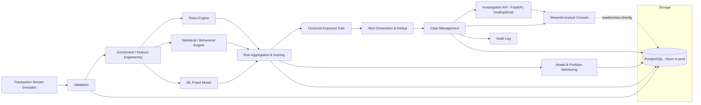
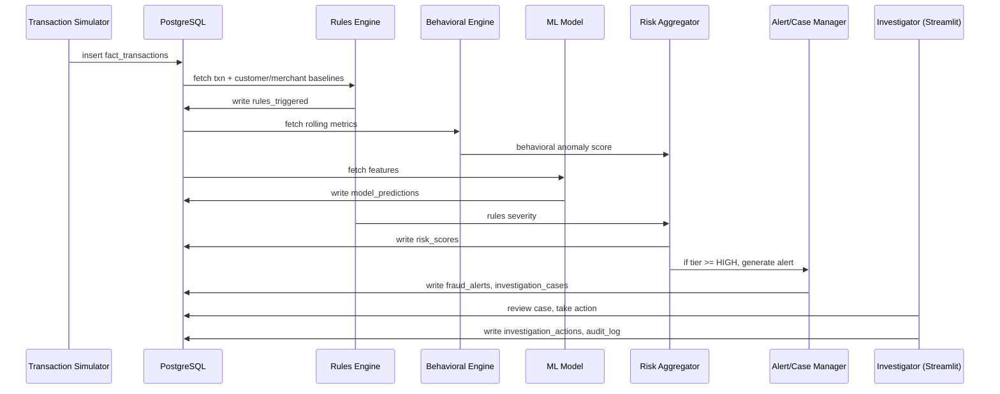
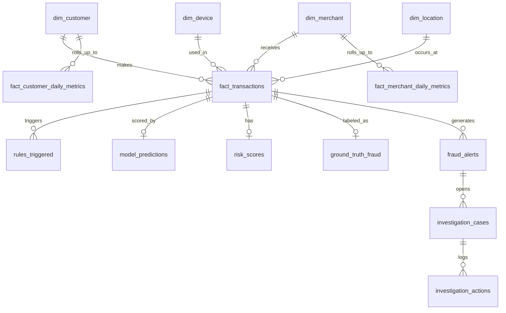
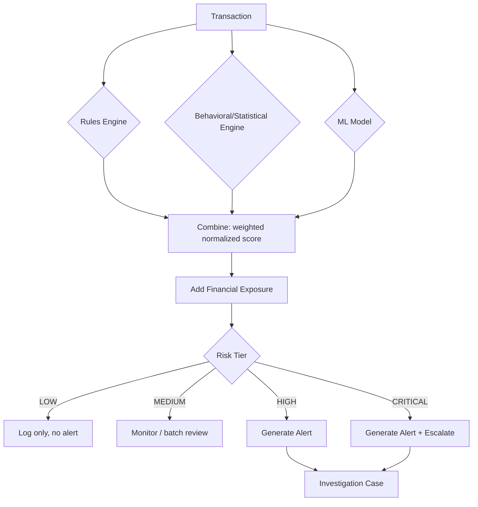
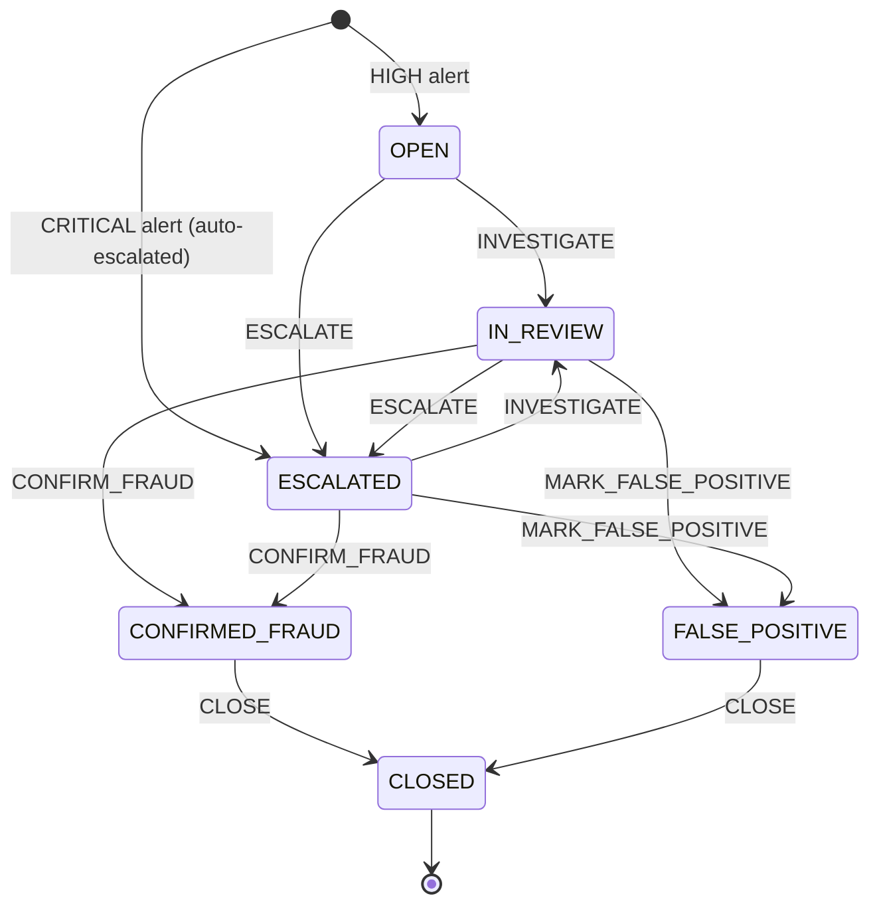
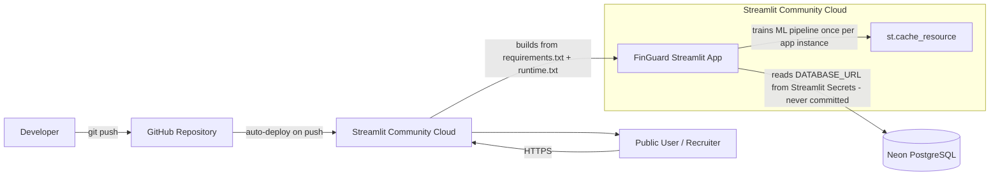

# 🛡️ FinGuard — Financial Fraud & Risk Intelligence Platform

**A production-style, end-to-end fraud risk operations platform** — hybrid detection (rules + statistical anomaly detection + supervised ML), a transparent explainable risk score, financial exposure simulation, an investigator case-management workflow with SLA tracking, and a live analyst dashboard. Deployed publicly on **Streamlit Community Cloud**, backed by **PostgreSQL on Neon**.

[](https://fintechgaurd.streamlit.app/)
[](https://github.com/Tisha1169/FinGuard-Financial-Fraud-Risk-Intelligence-Platform)

-336791?logo=postgresql&logoColor=white)


**🔗 Live Demo:** **[fintechgaurd.streamlit.app](https://fintechgaurd.streamlit.app/)** — publicly accessible, running against a real Neon Postgres database with 100K+ synthetic transactions.
**💻 Source:** **[github.com/Tisha1169/FinGuard-...-Platform](https://github.com/Tisha1169/FinGuard-Financial-Fraud-Risk-Intelligence-Platform)**

> **Deployment:** the app runs on **Streamlit Community Cloud**, with **PostgreSQL hosted on Neon** as the sole backing datastore. There is no separately hosted API — Streamlit connects to Neon directly (see [Deployment Architecture](#deployment-architecture) below for why, and exactly how).

---

## Table of Contents

1. [Project Summary](#project-summary)
2. [Why This Project Matters for Recruiters](#why-this-project-matters-for-recruiters)
3. [Problem Statement and Business Case](#problem-statement-and-business-case)
4. [What Makes This Different From a Basic Anomaly-Detection Project](#what-makes-this-different-from-a-basic-anomaly-detection-project)
5. [Key Capabilities](#key-capabilities)
6. [Major Results at a Glance](#major-results-at-a-glance)
7. [Tech Stack](#tech-stack)
8. [System Architecture](#system-architecture)
9. [End-to-End Data Flow](#end-to-end-data-flow)
10. [Database Schema](#database-schema)
11. [Hybrid Anomaly-Detection Methodology](#hybrid-anomaly-detection-methodology)
12. [Risk Scoring Framework](#risk-scoring-framework)
13. [Investigation Workflow](#investigation-workflow)
14. [Dashboard Walkthrough](#dashboard-walkthrough)
15. [Evaluation Methodology and Limitations](#evaluation-methodology-and-limitations)
16. [Deployment Architecture](#deployment-architecture)
17. [Local Setup](#local-setup)
18. [Cloud Deployment](#cloud-deployment)
19. [Security and Secrets Handling](#security-and-secrets-handling)
20. [Testing](#testing)
21. [Repository Structure](#repository-structure)
22. [Screenshots](#screenshots)
23. [Documentation Index](#documentation-index)
24. [Data Disclosure](#data-disclosure)
25. [Future Improvements](#future-improvements)

---

## Project Summary

FinGuard simulates how a bank or fintech's fraud operations function actually works, end to end:

**Transaction ingestion → hybrid detection (rules + statistics + ML) → a transparent, explainable combined risk score with financial exposure → a prioritized investigator case queue with SLA tracking → a live analyst dashboard.**

It is deliberately **not** a "train XGBoost, report an AUC" notebook. The supervised model is one input among four into a larger operational decision system — which is what fraud risk, transaction monitoring, and financial crime analytics roles actually look like day to day. Every fraud typology, detection layer, scoring decision, and business assumption in this repository is documented, tested, and — where a limitation exists — stated plainly rather than hidden.

---

## Why This Project Matters for Recruiters

This project was built to demonstrate the specific skills that separate a fraud/risk analytics hire from a general data science portfolio:

| Target Role | What This Project Demonstrates |
|---|---|
| **Financial / Risk Analyst** | Risk scoring methodology, tiering, financial exposure & cost-benefit trade-off analysis (investigation cost vs. loss prevented) |
| **Risk Manager / Risk Analytics** | Combining rules + statistical + ML signals into one auditable score; documented threshold policy vs. cost-optimal policy trade-offs |
| **Business Analyst / Data & BI Analyst** | KPI design (SLA compliance, fraud confirmation rate, false-positive rate), an executive dashboard, and SQL-driven reporting |
| **Operations Analytics / Trust & Safety** | A full case-management workflow (queue → assignment → investigation → resolution) with SLA tracking and investigator workload metrics |
| **Analytics Engineer** | A documented star-schema warehouse, leakage-safe SQL feature engineering, reproducible pipelines, and a tested, version-controlled codebase |
| **Fraud/Transaction Monitoring Analyst** | 9 realistic fraud typologies, a 7-rule detection engine with structured evidence, and honest per-rule precision/recall analysis |

Every metric below was independently verified by re-running the actual pipeline against a live database — not copied from a notebook and left unchecked.

---

## Problem Statement and Business Case

Financial institutions process millions of transactions daily, a small fraction of which are fraudulent. Detecting that fraction requires more than a classifier: an operational system must (1) generate a manageable number of alerts an investigation team can actually work, (2) explain *why* a transaction was flagged in language an investigator (not a data scientist) can act on, (3) track resolution against SLAs, and (4) reason about the financial trade-off between investigation cost and missed fraud.

FinGuard builds all four pieces on a synthetic dataset engineered to stress-test each one:
- A **rules engine** for interpretable, immediately-explainable signals
- A **statistical/behavioral anomaly engine** (IQR + Isolation Forest) for signals rules can't hand-code
- A **supervised ML model** (Logistic Regression + XGBoost) trained and evaluated with a genuinely time-aware, leakage-audited methodology
- A **combined, weighted risk score** with financial exposure and a documented cost-based threshold trade-off
- A **case management workflow** with SLA tracking, simulated investigators, and a full audit trail
- A **live Streamlit dashboard** any of the above can be inspected through, in production, right now

## What Makes This Different From a Basic Anomaly-Detection Project

| Basic Student Project | FinGuard |
|---|---|
| One model, one AUC number | Rules + statistical (IQR/Isolation Forest) + supervised ML, combined into one transparent score |
| Random train/test split | Strict **chronological** 70/15/15 split; zero temporal overlap enforced and tested |
| Accuracy as the headline metric | PR-AUC primary, recall@fixed-FPR, precision/recall@alert-volume — accuracy never reported (98%+ accuracy is trivial at a 2% fraud rate) |
| SMOTE applied by default | Class-weighting used deliberately, with a documented reasoned rejection of SMOTE for this dataset (see [Model Card](docs/model_card.md)) |
| "It works" and stops | 2 real calibration bugs found, diagnosed, fixed, and permanently regression-tested (see [Statistical Detection](docs/statistical_detection.md)) |
| No leakage audit | A dedicated leakage audit phase — including fixing an Isolation Forest that was originally fit on the full dataset before being caught and retrained train-only (see [Model Card](docs/model_card.md)) |
| Scores and stops | Scores flow into alerts → deduplicated case queue → simulated investigators → SLA metrics → audit log |
| Local notebook only | Deployed publicly on Neon + Streamlit Community Cloud, verified live end-to-end |
| Claims "prevented $X in fraud" | Every financial figure is explicitly labeled a simulation with stated assumptions — no real-world impact claims anywhere |

---

## Key Capabilities

| Component | What It Does |
|---|---|
| **Synthetic transaction generator** | 1,000 customers, 150 merchants, ~1,866 devices, 25 real-world cities, 103,651 transactions over a 120-day window, with 9 realistic fraud typologies injected as behavioral deviations |
| **Rules engine** | 7 configurable rules (velocity, amount spike, geo-impossible travel, failed-then-large, new device+location, merchant deviation, off-hours) — each returns severity + structured evidence, not a bare boolean |
| **Statistical anomaly engine** | IQR/Tukey-fence outlier scoring (robust, interpretable) + unsupervised Isolation Forest (multivariate) |
| **Supervised ML model** | Logistic Regression (interpretable baseline) + XGBoost (primary), time-aware split, SHAP explainability |
| **Combined risk score** | Transparent weighted blend of ML + rules + behavioral + financial-exposure components → LOW/MEDIUM/HIGH/CRITICAL tiers |
| **Financial exposure engine** | Simulated investigation cost, loss-prevented, and net-expected-impact trade-off across alert thresholds |
| **Investigation workflow** | Alert generation, deduplication, case creation, a validated case-status state machine, simulated investigator resolution, SLA compliance tracking |
| **Streamlit analyst console** | 5-tab live dashboard: executive KPIs, transaction intelligence, alert queue with live actions, Customer 360 case view, model/portfolio monitoring |
| **FastAPI service layer** | 9 REST endpoints (local/dev architectural layer — see [Deployment Architecture](#deployment-architecture) for why it isn't hosted separately) |
| **Test suite** | 161 automated tests, 85% coverage, including leakage-safety, reproducibility, and financial-math regression guards |

---

## Major Results at a Glance

All numbers below are reproduced from a fresh pipeline run against live Postgres and cross-checked against the live deployed dashboard — not hand-edited. Full methodology and honest limitations for every number are in the linked docs.

### Detection layer performance (evaluated against synthetic ground truth)

| Layer | Metric | Value |
|---|---|---|
| Rules engine (7 rules combined) | Recall / Precision | 74.0% / 8.4% |
| Statistical: IQR + frequency (noisy-OR) | AUC-ROC / Precision\@top-2% / Recall\@top-2% | 0.767 / 30.3% / 29.7% |
| Statistical: Isolation Forest | AUC-ROC / Precision\@top-2% / Recall\@top-2% | 0.917 / 46.4% / 45.5% |
| **XGBoost (primary supervised model)** | **PR-AUC / ROC-AUC (test set)** | **0.793 / 0.988** |
| XGBoost | Recall @ 1% FPR (test set) | 80.4% |
| Logistic Regression (baseline) | PR-AUC (test set) | 0.707 |

*(Rules-alone precision of 8.4% is not a flaw — it's the documented evidence for why rules, statistics, and ML are combined rather than any one shipped alone. See [Rules Engine](docs/rules_engine.md).)*

### Combined risk score — tier separation (full population, 103,651 transactions)

| Risk Tier | Transactions | Fraud Rate | Avg. Combined Score |
|---|---|---|---|
| CRITICAL | 1,240 | **70.6%** | 0.937 |
| HIGH | 4,743 | 21.7% | 0.599 |
| MEDIUM | 16,970 | 1.08% | 0.307 |
| LOW | 80,698 | **0.03%** | 0.096 |

A **>2,000x spread** in fraud rate between the lowest and highest tier — direct evidence the combined score, not just individual components, is doing its job.

### Operational / SLA metrics (simulated investigator workflow)

| Metric | Value |
|---|---|
| Alerts generated | 5,983 (4,743 HIGH, 1,240 CRITICAL) |
| Dedup groups | 5,295 |
| SLA compliance (resolved cases) | 93.7% overall (86.2% CRITICAL, 95.7% HIGH) |
| Median resolution time | 5.97 hours |
| Fraud confirmation rate | 35.8% |
| Financial exposure (all alerts) | $915,900 (simulated) |
| Net expected impact at optimal threshold | ~$15,988 (test set, simulated) |

---

## Tech Stack

| Layer | Technology |
|---|---|
| Language | Python 3.11 |
| Database | PostgreSQL (Neon in production, Docker locally) |
| Data / ML | pandas, NumPy, SciPy, scikit-learn, XGBoost, imbalanced-learn, SHAP |
| ORM / DB access | SQLAlchemy, psycopg2 |
| API (local/dev) | FastAPI, Uvicorn, Pydantic |
| Dashboard | Streamlit, Plotly |
| Testing | pytest, pytest-cov |
| Synthetic data | Faker |
| Local orchestration | Docker Compose |
| Cloud hosting | Neon (PostgreSQL) + Streamlit Community Cloud |

---

## System Architecture



**Deployment note:** production ships **only** Neon Postgres + Streamlit Community Cloud. Streamlit talks to Postgres directly. FastAPI is built, tested, and documented as an architectural layer but is **not** deployed as a separate service — it runs locally, avoiding an unnecessary second hosting dependency for a portfolio deployment.

## End-to-End Data Flow



## Database Schema

16 tables: 4 dimensions, 3 transaction/rollup facts, 4 detection-output tables, 3 case-management tables, 2 monitoring/audit tables. Full grain, keys, and rationale for every table: [docs/data_dictionary.md](docs/data_dictionary.md).



<details>
<summary><strong>All 16 tables (click to expand)</strong></summary>

| Table | Grain |
|---|---|
| `dim_customer` | One row per customer |
| `dim_merchant` | One row per merchant |
| `dim_device` | One row per device fingerprint |
| `dim_location` | One row per (city, country) pair |
| `fact_transactions` | One row per transaction (central fact table) |
| `fact_customer_daily_metrics` | One row per customer per day (precomputed rolling baselines) |
| `fact_merchant_daily_metrics` | One row per merchant per day |
| `rules_triggered` | One row per rule firing per transaction |
| `ground_truth_fraud` | One row per labeled transaction (synthetic label) |
| `model_predictions` | One row per (transaction, model version) scored |
| `risk_scores` | One row per transaction — final combined assessment |
| `fraud_alerts` | One row per alert, post-deduplication |
| `investigation_cases` | One row per case |
| `investigation_actions` | One row per investigator action (append-only) |
| `model_monitoring_metrics` | One row per (model, version, period) |
| `audit_log` | One row per auditable system event (append-only) |

</details>

---

## Hybrid Anomaly-Detection Methodology

Three independent detection layers feed the combined risk score — chosen deliberately for complementary strengths, not redundancy.

### 1. Rules Engine (7 rules)

| Rule | Logic | Precision (standalone) |
|---|---|---|
| `R1_VELOCITY` | ≥3 txns/10min or ≥6/60min | 98.9% |
| `R2_AMOUNT_SPIKE` | z-score ≥4 vs. 90-day customer baseline | 29.5% |
| `R3_GEO_IMPOSSIBLE` | Implied travel speed >900 km/h between consecutive txns | 4.0% |
| `R4_FAILED_THEN_LARGE` | ≥2 failed attempts in 15min, then an approved txn ≥4x baseline | 100.0% |
| `R5_NEW_DEVICE_NEW_LOCATION` | Device *and* location both never seen before | 5.5% |
| `R6_MERCHANT_DEVIATION` | Amount ≥3x merchant's own 90-day average | 17.1% |
| `R7_OFF_HOURS` | Hour of day never seen before for this customer | 7.0% |

Two implementations share one threshold config: a per-transaction path (live scoring) and a vectorized batch path (backfilling ~104k transactions in **2.4 seconds** vs. an estimated ~1M-query, tens-of-minutes naive approach) — cross-verified to agree exactly. Full detail: [docs/rules_engine.md](docs/rules_engine.md).

### 2. Statistical / Behavioral Engine

- **IQR/Tukey fences** — robust to outliers (median/quartile-based, not mean/stddev), per-customer and per-merchant.
- **Isolation Forest** — unsupervised, multivariate; catches feature *combinations* (e.g. normal amount + odd hour + new device + recent failures) that no single-feature rule can see.

Combined via noisy-OR into `behavioral_anomaly_score`. Full methodology, two real calibration bugs found and permanently regression-tested, and per-typology evidence for *why* Isolation Forest outperforms the simpler method on multivariate-defined fraud: [docs/statistical_detection.md](docs/statistical_detection.md).

### 3. Supervised ML Model

Logistic Regression (interpretable baseline, `class_weight="balanced"`) + XGBoost (primary, `scale_pos_weight` computed from training data only, conservatively tuned via a 3-configuration validation-scored grid). 37 features after preprocessing. SHAP used for both global feature importance and individual prediction explanations — verified via the SHAP additivity property, not just plotted. Full model card: [docs/model_card.md](docs/model_card.md); full evaluation report: [docs/evaluation_report.md](docs/evaluation_report.md).

**Leakage discipline (the part most portfolio projects skip):**
- Strict **chronological** 70/15/15 split — zero shuffling, zero temporal overlap, enforced by test.
- All preprocessing (imputation, encoding, scaling) fit on **training data only**.
- The Isolation Forest feature is fit on the **training period only** and transformed (never refit) onto validation/test — a real leakage risk found and fixed during an internal audit (the original Phase 5 version was fit on the whole dataset; reusing it directly as an ML feature would have leaked test-period structure into training).
- A label-derived feature (`chargeback_rate_90d`) was proven temporally safe **and still excluded** from the primary model, because its next-day availability is unrealistic versus real-world chargeback reporting lag — a judgment call about real-world deployability, not just leakage.

---

## Risk Scoring Framework

```
combined_score = 0.40 × ml_component + 0.20 × rules_component + 0.20 × behavioral_component + 0.20 × exposure_component
```

| Component | Weight | Source |
|---|---|---|
| `ml_component` | 0.40 | XGBoost fraud probability |
| `rules_component` | 0.20 | Highest-severity rule fired + multi-rule bonus |
| `behavioral_component` | 0.20 | Noisy-OR of IQR/frequency score and Isolation Forest score |
| `exposure_component` | 0.20 | Transaction amount vs. a 95th-percentile (training-only) cap |

A **weighted sum** — chosen over a noisy-OR for this final blend specifically because every component's dollar-and-cents contribution to the final number is directly readable by an investigator, which the Customer 360 dashboard view depends on. Tier cutpoints (LOW/MEDIUM/HIGH/CRITICAL) are quantiles of the **validation-split** score distribution only, never test. Full methodology, weight justification, and the financial threshold sweep: [docs/risk_scoring.md](docs/risk_scoring.md).



---

## Investigation Workflow

HIGH/CRITICAL-tier transactions generate alerts (deduplicated within a 60-minute customer window), open a case with an SLA (4h for CRITICAL, 24h for HIGH), and move through a validated status state machine — the **same** state machine module drives both the FastAPI action endpoint and the dashboard's live action buttons, so there is exactly one definition of a valid transition in the codebase.



An investigator simulation (`INVESTIGATOR_ACCURACY = 90%`) resolves cases; the resulting fraud-confirmation rate was cross-checked against the theoretical value implied by that accuracy assumption and matched within simulation noise — verified, not just assumed correct. Full detail, including a genuine operational insight (CRITICAL cases resolve faster in wall-clock time but have *lower* SLA compliance, because their SLA target is proportionally stricter): [docs/investigation_workflow.md](docs/investigation_workflow.md).

---

## Dashboard Walkthrough

Live at **[fintechgaurd.streamlit.app](https://fintechgaurd.streamlit.app/)** — 5 tabs, all reading/writing the live Neon database in real time.

| Tab | Contents |
|---|---|
| **Executive Risk Overview** | KPI row (volume, alerts, confirmed fraud, financial exposure, loss prevented, false-positive rate, open investigations, SLA compliance), transaction/fraud trend chart, risk-tier distribution |
| **Transaction Risk Intelligence** | Filterable/searchable transaction table joined with risk scores; per-transaction score breakdown and rule evidence |
| **Fraud Alert & Investigation Queue** | HIGH/CRITICAL cases sorted by score; live assign/action forms that write directly to Postgres, validated against the case state machine |
| **Case Investigation — Customer 360** | Full workbench: transaction detail, customer/merchant context, risk score breakdown, rules with structured evidence, SHAP model explanation (where available), customer transaction timeline, previous alerts, audit history |
| **Model & Portfolio Monitoring** | Test-set PR-AUC/ROC-AUC/precision/recall (XGBoost vs. Logistic Regression), score distribution, global SHAP importance, live financial threshold sweep, segment performance |

Full architecture and a documented UX bug found and fixed via manual browser testing: [docs/dashboard.md](docs/dashboard.md).

---

## Evaluation Methodology and Limitations

- **Metric choice:** PR-AUC is the headline metric, never accuracy — at a ~2% fraud rate, a model predicting "never fraud" scores ~98% accuracy while catching zero fraud.
- **Temporal integrity:** chronological split, zero overlap, all learned preprocessing fit on training data only — enforced by dedicated tests, not just described.
- **Honest degradation reported:** both models show a real validation→test PR-AUC drop (XGBoost −8.4%, Logistic Regression −10.3%) — presented as-is, since no threshold or hyperparameter selection ever touched the test set to mask it.
- **Error analysis, not just aggregate metrics:** the model's weakest typology (`GEOGRAPHIC_INCONSISTENCY`, 39.7% recall) has an identified, addressable cause — no raw geo-distance feature was carried into the model, only a rule's pass/fail flag — documented as a concrete lever for a future iteration, not glossed over.
- **Synthetic-data caveats, stated everywhere they apply:** the 2% injected fraud rate is far higher than real-world card fraud (<1%); each typology is a clean, internally consistent signature (real fraud is noisier); legitimate-but-unusual behavior isn't separately modeled, so real-world precision is likely lower than shown here. **No claim of real-world fraud prevention or financial impact is made anywhere in this project.**

Full detail: [docs/model_card.md](docs/model_card.md), [docs/evaluation_report.md](docs/evaluation_report.md), [docs/testing_strategy.md](docs/testing_strategy.md).

---

## Deployment Architecture

**Production runs on two managed services only — no self-hosted infrastructure, no separately hosted API.**



- **Compute + hosting:** Streamlit Community Cloud — builds directly from this GitHub repository on every push to `main`, serves the app over HTTPS.
- **Database:** Neon serverless PostgreSQL — the single source of truth; the deployed app connects to it directly for every read and write (case actions, alert queue updates) — there is no caching layer that could serve stale writes silently.
- **No separate API host:** FastAPI (`api/`) is a fully built, tested, and documented architectural layer, but is intentionally **not** deployed as a second hosted service — the dashboard talks to Postgres directly, and a shared module (`investigation/case_actions.py`) is called by both the API and the dashboard so case-mutation logic is never duplicated between them.
- **Secrets:** the Neon connection string lives only in Streamlit Community Cloud's encrypted app secrets — never committed to this repository (see [Security and Secrets Handling](#security-and-secrets-handling)).
- **Cold start:** the ML pipeline (Logistic Regression + XGBoost + Isolation Forest) trains once per app instance via `st.cache_resource`, not per request — the first page load after a restart takes ~10-15 seconds longer than subsequent ones by design.

Full deployment guide, including a real incident (`pyarrow` had no prebuilt wheel for the Python version Streamlit Cloud's build used) that was diagnosed and fixed, documented for anyone repeating this deployment: [docs/deployment.md](docs/deployment.md).

---

## Local Setup

```bash
cp .env.example .env
docker compose up -d
python -m venv .venv && source .venv/bin/activate
pip install -r requirements.txt -r requirements-dev.txt   # dev adds pyarrow (data scripts) + pytest
python scripts/init_db.py
python scripts/generate_data.py    # writes data/*.parquet
python scripts/load_data.py        # loads them into DATABASE_URL
python scripts/compute_features.py # populates rolling baseline tables
python scripts/run_rules.py        # backfills rules_triggered
python scripts/run_statistical_detection.py  # IQR + Isolation Forest scores
python scripts/train_models.py     # Logistic Regression + XGBoost, time-aware split
python scripts/run_risk_scoring.py # combined risk score, tiers, financial exposure
python scripts/run_investigation_workflow.py  # alerts, cases, simulated investigators
uvicorn api.main:app --reload      # local API (optional) - see docs/api.md
streamlit run streamlit_app/app.py # analyst console - see docs/dashboard.md
```

## Cloud Deployment

Summary — full step-by-step guide with a real troubleshooting log: [docs/deployment.md](docs/deployment.md).

1. **Neon:** create a free project at [neon.tech](https://neon.tech), copy the pooled connection string.
2. **Load data:** run the same pipeline scripts as [Local Setup](#local-setup) above with `DATABASE_URL` pointed at Neon instead of local Docker.
3. **Streamlit Community Cloud:** sign in at [share.streamlit.io](https://share.streamlit.io) with GitHub, create a new app from this repository, main file path `streamlit_app/app.py`.
4. **Secrets:** in the app's Advanced Settings, add `DATABASE_URL = "<your Neon pooled connection string>"` — never commit this value.
5. **Deploy.** The app builds from `requirements.txt` + `runtime.txt` (pinning Python 3.11) and connects to Neon on first load.

---

## Security and Secrets Handling

- **No credentials are ever committed.** `.env`, `.streamlit/secrets.toml`, and `artifacts/` are all gitignored; only `.env.example` and `.streamlit/secrets.toml.example` (placeholder values) are tracked.
- **Environment-aware config:** `database/connection.py` reads `DATABASE_URL` from an environment variable locally and from `st.secrets` on Streamlit Community Cloud — the same code path, no hardcoded connection strings anywhere.
- **No full payment card numbers are ever stored** — `payment_instrument_last4` stores exactly 4 digits, matching real-world PCI-DSS practice even though all data here is synthetic.
- **Graceful failure, not crashes:** both the API's `/health` endpoint and the dashboard's direct connection check return a friendly degraded-status message rather than an unhandled exception if the database is unreachable.
- **No authentication on the API/dashboard** — appropriate and disclosed for a local/dev or public-portfolio-demo layer, explicitly *not* presented as production-hardened.

---

## Testing

**161 automated tests, 85% statement coverage**, run with `pytest`. All database-dependent tests skip gracefully (not fail) when no database is configured — 91 tests pass completely standalone.

| Area | Coverage | What's Verified |
|---|---|---|
| Data generation | 88–100% | Reproducibility, typology correctness, referential integrity |
| Feature engineering | 100% | Leakage boundaries, cross-checked against an independent pandas computation |
| Rules engine | 85–99% | Batch-vs-live consistency on real data |
| Statistical/anomaly detection | 100% | Calibration regression guards for 2 real bugs found and fixed |
| Supervised ML | 83–100% | Split integrity, train-only fitting, SHAP additivity property |
| Risk scoring | 95–100% | Component math, tier monotonicity, financial simulation arithmetic |
| Investigation workflow | 95–100% | State machine transitions, SLA calculations |
| API | 76–100% | Every endpoint, filter combination, 404/409 error paths |
| Streamlit dashboard | Pure-logic helpers unit-tested; UI verified by driving a live browser session against real data (see [docs/testing_strategy.md](docs/testing_strategy.md) for why this is deliberate, not a gap) |

```bash
python -m pytest -q                                 # full suite
python -m pytest --cov=. --cov-report=term-missing   # with coverage
```

Full strategy, including documented known gaps: [docs/testing_strategy.md](docs/testing_strategy.md).

---

## Repository Structure

```
data_generation/   synthetic transaction/entity generator (9 fraud typologies)
data/              generated datasets (parquet, gitignored — regenerate via scripts/)
sql/               schema.sql, feature-engineering SQL
database/          connection layer (env var locally, st.secrets on Streamlit Cloud)
features/          point-in-time / leakage-safe feature engineering
rules/             7-rule business rule engine (live + vectorized batch)
models/            statistical (IQR/Isolation Forest) + supervised ML (LogReg/XGBoost) models
risk_scoring/      combined score, tiers, financial exposure simulation
investigation/     alert/case/state-machine logic, shared by the API and dashboard
api/               FastAPI service (local/dev architectural layer, not separately hosted)
streamlit_app/     the deployed analyst console (5 tabs)
monitoring/        reserved for future drift/PSI monitoring — not yet implemented
tests/             161-test pytest suite
deployment/         Docker Compose, deployment quick-reference
docs/              architecture, data dictionary, model card, evaluation report, and more
scripts/           reproducible pipeline entrypoints (generate → load → score → investigate)
```

## Screenshots

The fastest way to see the platform is the **[live demo](https://fintechgaurd.streamlit.app/)** — every tab below is publicly viewable right now. Static screenshots are not yet committed to this repository; the recommended structure for adding them is:

| File (to add under `docs/screenshots/`) | Capture |
|---|---|
| `01_executive_overview.png` | Executive Risk Overview tab, full KPI row + charts |
| `02_transaction_intelligence.png` | Transaction table with a CRITICAL-tier transaction expanded |
| `03_alert_queue.png` | Alert & Investigation Queue with the action panel open |
| `04_case_investigation.png` | Customer 360 view for a confirmed-fraud case |
| `05_model_monitoring.png` | Model & Portfolio Monitoring tab, XGBoost vs. Logistic Regression comparison |

## Documentation Index

| Doc | Covers |
|---|---|
| [docs/architecture.md](docs/architecture.md) | Full architecture + all Mermaid diagrams |
| [docs/data_dictionary.md](docs/data_dictionary.md) | Every table's grain, keys, and design rationale |
| [docs/data_generation.md](docs/data_generation.md) | Synthetic dataset & 9 fraud typologies |
| [docs/feature_engineering.md](docs/feature_engineering.md) | Rolling baselines & leakage-prevention design |
| [docs/rules_engine.md](docs/rules_engine.md) | 7 rules, thresholds, per-rule evaluation |
| [docs/statistical_detection.md](docs/statistical_detection.md) | IQR/Isolation Forest methodology, bugs found & fixed |
| [docs/model_card.md](docs/model_card.md) | ML model purpose, features, leakage audit, intended/non-intended use |
| [docs/evaluation_report.md](docs/evaluation_report.md) | Full results, SHAP findings, error analysis |
| [docs/risk_scoring.md](docs/risk_scoring.md) | Combined score methodology, weights, financial simulation |
| [docs/investigation_workflow.md](docs/investigation_workflow.md) | Alerts, cases, SLA, investigator simulation |
| [docs/api.md](docs/api.md) | FastAPI endpoints |
| [docs/dashboard.md](docs/dashboard.md) | Streamlit console architecture & verification |
| [docs/testing_strategy.md](docs/testing_strategy.md) | Full test suite rationale and coverage |
| [docs/deployment.md](docs/deployment.md) | Neon + Streamlit Cloud deployment guide, real incident log |

## Data Disclosure

All transaction and fraud-label data in this project is **entirely synthetic**, generated to mimic realistic fraud typologies (card testing, velocity abuse, account takeover, geographic inconsistency, and more — see [docs/data_generation.md](docs/data_generation.md)). No real transaction, customer, or institutional data is used anywhere. `ground_truth_fraud.is_synthetic_label` is `true` for every row in the database. **No claim of real-world fraud prevention or financial savings is made anywhere in this project** — every business-impact figure is explicitly labeled a simulation with stated assumptions.

## Future Improvements

- **Drift/PSI monitoring** — the `monitoring/` module is scaffolded but not yet implemented; tracking feature and score drift over time is the next planned enhancement.
- **Carry rule evidence magnitude into the ML feature set** — the model currently only sees *whether* a rule fired, not the underlying distance/speed/z-score value; the error analysis identifies this as the most concrete lever for improving recall on geo- and time-based fraud typologies.
- **Cost-sensitive, continuously-tuned threshold policy** — the current alert policy uses fixed risk tiers; a production system would revisit the cost-optimal threshold from `docs/risk_scoring.md` on a schedule as fraud patterns shift.
- **Automated UI regression testing** (e.g. Playwright) — the dashboard is currently verified via manual browser sessions, documented as a deliberate trade-off in [docs/testing_strategy.md](docs/testing_strategy.md), not a permanent limitation.
