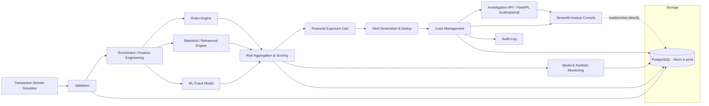
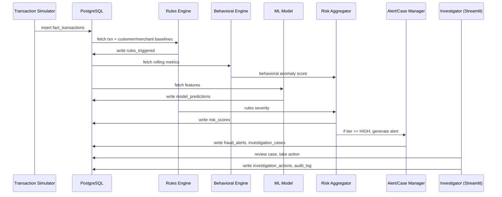
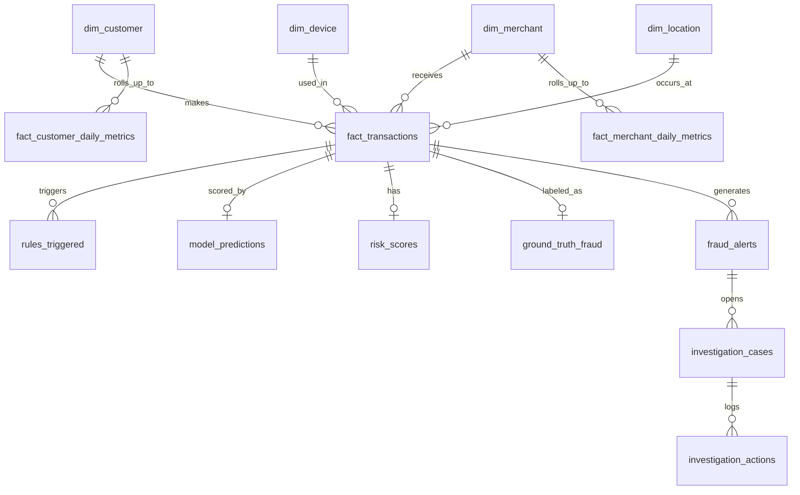
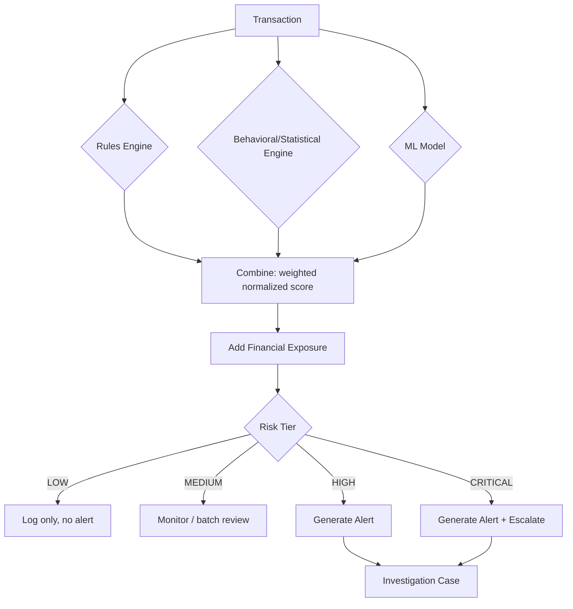
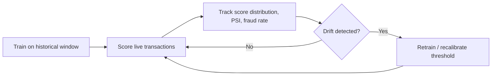

# FinGuard Architecture

## System Architecture

**Deployment note:** production only ships Neon Postgres + Streamlit
Community Cloud. Streamlit talks to Postgres directly for the deployed app.
FastAPI is built and tested as an architectural layer (and documented with
its own endpoints) but is not deployed as a separate service — it runs
locally/in Docker for development and interview demonstration, avoiding an
unnecessary second hosting dependency.

## Transaction → Investigation Flow

## Database Schema (entity relationships)

## Risk Decision Flow

## Model & Monitoring Lifecycle

